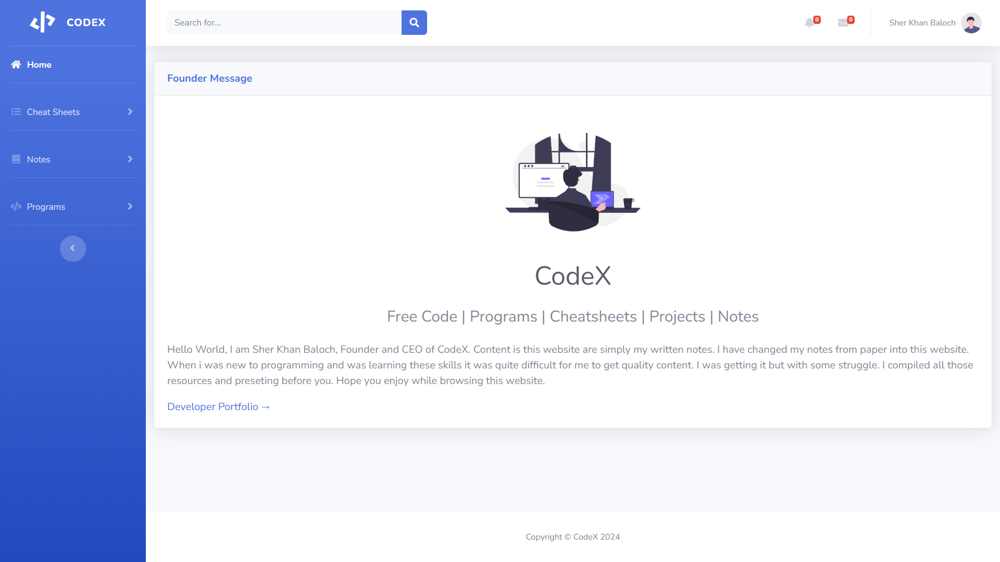

# CodeX

## Features:
- CheatSheets
    1. HTML 5 Cheatsheet
    2. CSS 3 Cheatsheet
    3. JavaScript Cheatsheet
    4. C++ Cheatsheet

- Notes
    1. C++ (FoP)
    2. Java (OOP)
    3. Assembly 8086
    4. SQL Server

- Programs
    1. C++

## Tech Used:
- Frontend: Bootstrap

## Contact:
- Email: sherkhanbaloch@outlook.com
- WhatsApp: +923282342800
- Website: [Portfolio](https://sherkhanbaloch.github.io/Portfolio/)

Full Video: -

# Screenshots

